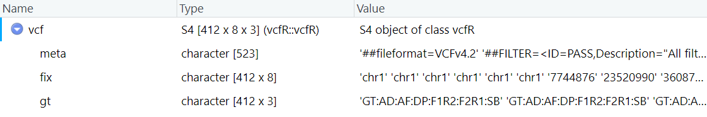
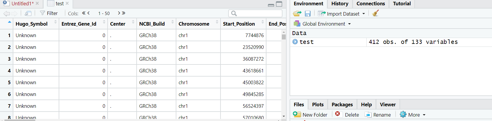
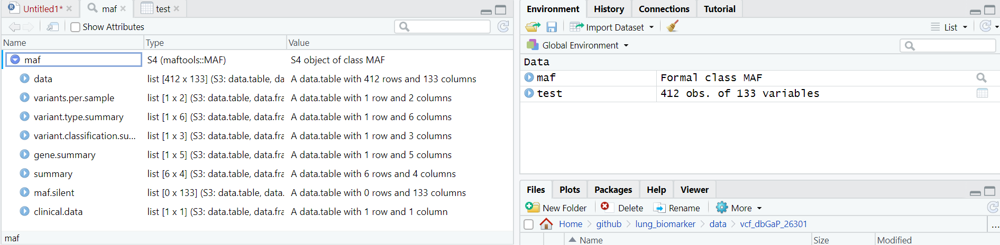

#### 目录

- vcf文件读取
- maf文件读取


#### vcf读取

- sigminer包中的`read_vcf()`

在使用sigminer包进行signature提取的过程中，输入数据是支持vcf，maf，excel等等

```R
library("sigminer")
test_vcf <- read_vcf("~/github/lung_biomarker/data/vcf_dbGaP_26301/pass/AL4602_pass.vcf")
```

但是我的vcf读入报错如下，可能是格式有问题：

```R
Reading file(s): ~/github/lung_biomarker/data/vcf_dbGaP_26301/pass/AL4602_pass.vcf
Error in data.table::fread(., select = c(1, 2, 4, 5, 7)) : 
  Column number 4 (select[3]) is too large for this table, which only has 2 columns.
此外: Warning message:
In data.table::fread(., select = c(1, 2, 4, 5, 7)) :
  Detected 1 column names but the data has 2 columns (i.e. invalid file). Added 1 extra default column name for the first column which is guessed to be row names or an index. Use setnames() afterwards if this guess is not correct, or fix the file write command that created the file to create a valid file.

```

由于该包提供maf读取功能，因此将vcf转成了maf，vcf转maf可以阅读 **vcf转maf** 部分的笔记。

- `vcfR`

```R
library(vcfR)
vcf_file="~/lung_biomarker/data/vcf_dbGaP_26301/pass/AL4602_pass.vcf"
vcf <- read.vcfR( vcf_file, verbose = FALSE )
```

读入为S4对象




#### maf读取

该sigminer包中的`read_maf`函数是调用`maftools`中的`read.maf()`函数，`read.maf()`函数中的参数`read_maf`中也都可以使用。

```R
test_maf <- read_maf("~/github/lung_biomarker/data/maf/AL4602.maf")
```

但是出现以下报错，提示表示没有非同义突变读取：

```R
-Reading
-Validating
-Silent variants: 412 
Error in maftools::read.maf(maf, clinicalData = NULL, removeDuplicatedVariants = TRUE,  : 
  No non-synonymous mutations found
Check `vc_nonSyn`` argumet in `read.maf` for details
```

根据包的作者以及`sigminer`包的开发者在github上的意见，我认为暂时应该这样解决：

```R
test <- data.table::fread("~/github/lung_biomarker/data/maf/AL4602.maf")
```

以`data.table`的格式读取，结果如下：



接着查看突变分类

```R
table(test$Variant_Classification)

Targeted_Region 
            412 
```

将得到的突变分类写入参数 `vc_nonSyn = `当中：

```R
maf <- maftools::read.maf("~/github/lung_biomarker/data/maf/AL4602.maf",
                          vc_nonSyn = "Targeted_Region")
```

成功读入maf格式

