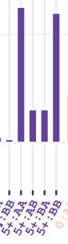
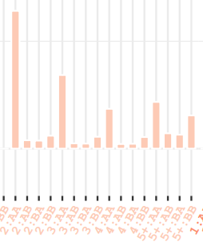
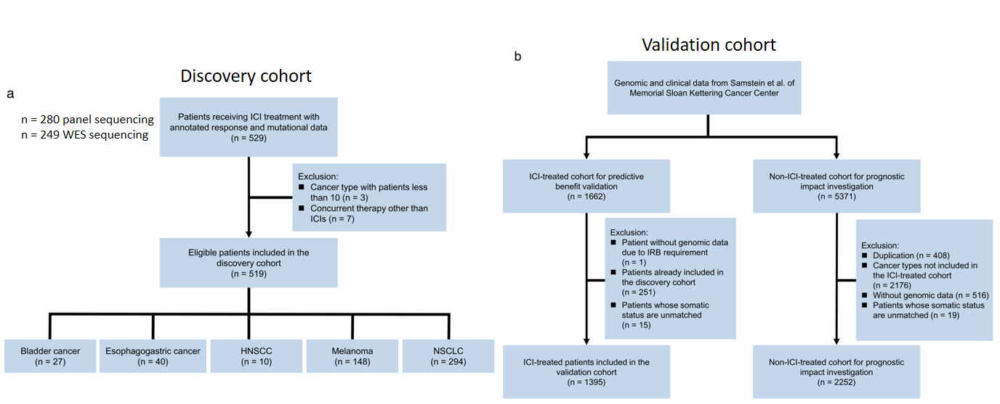
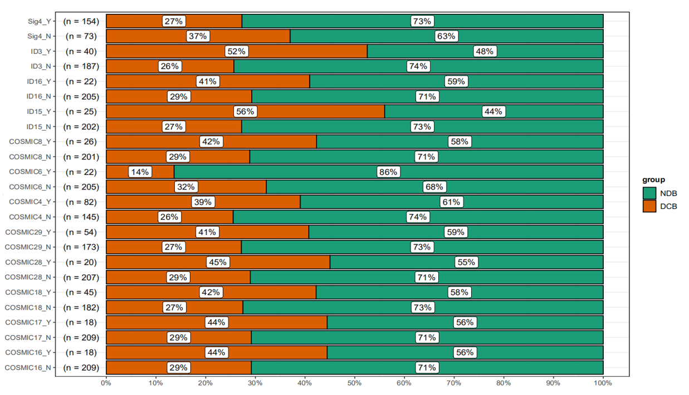
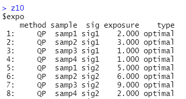
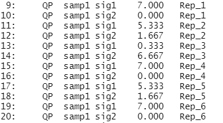

#### signature predict分析过程

#### signature stability方面

#### 需要修改的几个方面

- 热图排序

  去掉MSI score以及aneuploidy score等和immune没有关系的指标，再把是同一个规律性的东西放在一起看，比如，把免疫浸润的细胞浸润水平单独做一个热图，再把MSI score单独做一个热图，**把通过immune landscape这篇文章得到的6中分类做一个热图bar**，结合在一起看而不是把结果全部放在一起看的不清楚。

- signature分类去0以及合并分类至总的分类减少到200个以内

  - 分类去0

    不要在组合的时候去掉不需要的组合，在最后`s_mat`得到的总的矩阵里面进行删去为0的组合，并且在删除之后，其中`S:HL:3:BB` 虽然结果为0，但是由于从理论上不好解释，把它纳入合并分类中去，记得删除之后要写注释信息。

  - 合并分类

    每个拷贝数每个拷贝数的看，下图中左图的规律就是AA和BB多，但是右图中是只有AA多，可以把很少的进行合并，不过需要一个一个的看，有点麻烦，这个参考图需要去完上面分类为0的再进行分类去看，并且最好去解释一下这个分类之间的规律，可以看的方面：拷贝数和变化之间的关系等等，看结果吧。

               

- 用文献汇报中的1000+个ICI-treated cohort样本（不用局限于NSCLC的样本，可以做完之后再看melanoma和NSCLC的结果是不是更好，最后挑出来），记得去除重复数据，保证cohort中没有重复的样本，搜集一下这些数据，然后把这些数据的突变数据收集到整理好（这周六周日做完）

  - 用signature去predict，分为两个方面

    - R/NR（DCB/NDB），做logistic回归，再做ROC曲线进行二分类

    - Survival，做cox分析，再做cut point，这部分可以做交叉验证和机器学习，深度学习（但是暂时先把流程练的过硬，这部分之后再考虑）

      建模有一个包叫`cavet`效果很好

- signature做biomarker的稳定性
  - 病人分组，可以分成discovery cohort(3/4)，validate cohort(1/4)，这两个分组需要保证变量age和sex所占的比例是一样的，因为sex不同，免疫反应是不一样的，age不同（忘了有没有不同）也要考虑，尽量保障变量的平衡性，以下面这个图为例，就是有问题的，具有误导性，因为有和没有这个signature的病人的数量是不一样的，这个图可以改成箱线图去画，舍弃这种形式的图，而且这个

  - 图也不是很重要，大致看一下就好，可以show在组会上。

    

- 现在针对wes的数据集（panel的可以先做，也可以放一下，流程都是以下的方面）

  - 关于relative data和absolute data

    两个都做一遍流程，把代码模块化，通过修改变量对它进行一个结果的更改，得到的结果可以做一个比较。最后采取absolute的exposure去做，这样可以直观地表示。

  - 多因素分析的cox分析可以用师兄的`ezcox`包去做

    cox分析不要自己设置cut off去做，用signature exposure连续值去做，出现结果比较好的情况的时候，再去用cut off，cut-off会很大的影响结果的好坏，虽然没有指标去衡量分类，但是要记得这点哈。

  - 建模师兄提到一个很好用的包，记得找他要他忘记了

  - 卡方检验和wilcox分析选择，选择非参数检验去做。

  - 提取signature exposure验证它的稳定性

    用bootstrap去做，取1000次抽样，取exposure的均值，type一列的optimal是和sig_fit()提取得到的是一样的结果，rep_n是重复次数，根据同一个signature重复的记录，取exposure的均值。

    

biomarker可以做的方面
大的方面有两个

- 从底层做signature的方法，它作为biomaker需要满足哪些条件
- 具体的signature可以去做biomarker
这个又可以分为作为source的方面，即不说明它的意义
还有可以具体的做到一个具有生物学意义的biomarker，去做一个好的预测

具体的小的部分
- signature做biomarker的稳定性
比如panel，biomarker是否在不同的病人群体中都是能够很好的去预测
- 几百个免疫的指标，一百多个signature

- 做biomarker的话，预后和免疫治疗预测
预后：病人来了，用signature去看它生存的好坏
免疫治疗预测：这个病人没有做免疫治疗，指导这个病人用哪种免疫治疗方法

- nature cancer在不同的tissue中的，即不同的cancer中哪些signature更好

- 和HR等等

### 自己的理解

- signature做biomarker，要考虑到预测现象的敏感度

### 老师的建议

用TCGA全部的数据signature做一个预后

要用TCGA的数据去做signature的话，可以把v2，v3版本做一个交集，另外提出来的signature要做bootstrap，

sig_fit提取得到的有>20%和COSMIC上不同，

