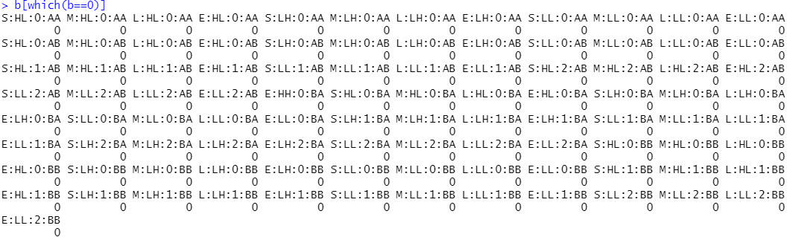
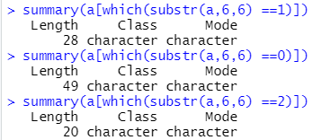

目前准备的数据：

`cn`

```
> cn <- readRDS("D:/data/pcawg_cn_obj.rds")
> cn_tally <- sig_tally(cn, method = "T")
> cn_tally$nmf_matrix %>% colnames()
> show_catalogue(cn_tally, mode = "copynumber", method = "T", style = "cosmic")

```

用来测试的数据：data，从cn中获得

```R
> data <- sigminer::get_cnlist(cn, add_index = TRUE)
```

所有计数为0：



a是上面取得子集内容：

本身拷贝数为0，1，2同时计数为0的分别有以下几种：



其中：E:HH:0:BA也是计数为0