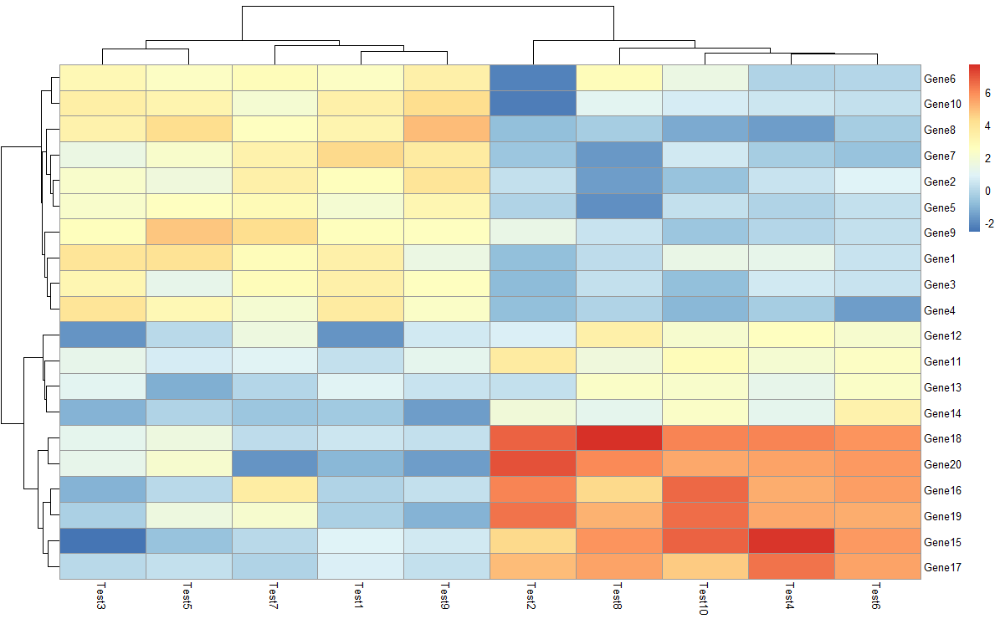
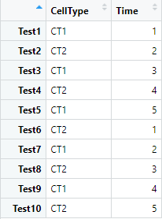
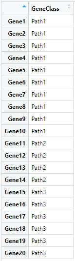
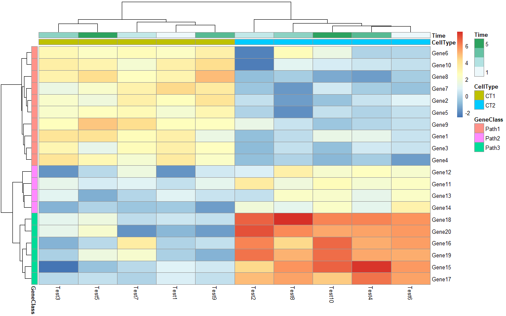

mobaxterm


##### 热图示例

```R
test = matrix(rnorm(200), 20, 10)
test[1:10, seq(1, 10, 2)] = test[1:10, seq(1, 10, 2)] + 3
test[11:20, seq(2, 10, 2)] = test[11:20, seq(2, 10, 2)] + 2
test[15:20, seq(2, 10, 2)] = test[15:20, seq(2, 10, 2)] + 4
colnames(test) = paste("Test", 1:10, sep = "")
rownames(test) = paste("Gene", 1:20, sep = "")
pheatmap(test)
```




##### 热图标注人工分组信息

```R
annotation_col <- data.frame(CellType = 
                               factor(rep(c("CT1","CT2"), 5)), Time = 1:5)
rownames(annotation_col) = paste("Test", 1:10, sep = "")

annotation_row <- data.frame(GeneClass = factor(rep(c("Path1","Path2","Path3"),c(10,4,6))))
rownames(annotation_row) = paste("Gene", 1:20, sep = "")
pheatmap(test, annotation_col = annotation_col, 
         annotation_row = annotation_row)
```


看一下用于分组的数据，左边是annotation_col，右边是annotation_row


                                             

加上分组信息的热图


