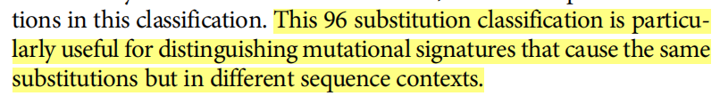

- cancer and signature
- signature technology
- signature meaning
- uses

​	Somatic mutations cause all cancers. It's still unclearly the process of generating somatic mutations. Mutational processes catelogue is nesscecary to classify all somatic mutations which stand for biological process.

​	癌症的发生是由于内源性和外源性的致癌因素诱导的，会引起体细胞突变，体细胞突变有很多种情况，涉及到单点突变、双位点突变、插入和缺失以及拷贝数变化等等，但是造成体细胞突变的突变过程仍然不清楚，将不同的突变过程产生的不同的突变类型的组合称为"signature"。【我觉得理想情况下，应该是一种突变过程对应各个不同的突变类型的组合】

​	最先开始的时候，需要从每个癌症样本中得到一个单个的突变来形成突变集合从而得到signature，但是当涉及到多个突变过程的发生时，这样产生的signature是混乱的。随着测序技术的发展，单个癌症样本也能够得到成百上千的体细胞突变，即使涉及到不同的突变过程，突变signature也能够很好的提取出来。Alexandrov采用了21例乳腺癌病人的全基因组序列提取signature，另外还有研究表明，尽管效力比较低，但是全外显子序列也可以提取signature。

### Q&A

**Q：在signature中，会考虑到突变位置前后的序列，即 information on the sequence context of each mutation，为什么？**

A：通俗的讲是将突变周围的环境考虑进来，原文中这样描述 (Alexandrov et al., 2013)，为了将不同环境中发生的突变进行区分，我的理解是由于密码子是三个序列，可以知道有没有发生使得密码子编码发生变化的情况，至于非SBS也考虑进周围的context，可能是和周围的序列特征有关，比如重复序列多的情况下，就可能和引起突变发生的生物学过程相关：

