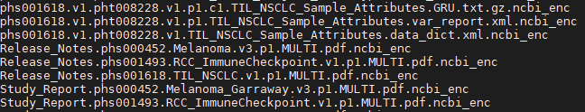

今天把官网流程全部看了一遍按照这样操作了，看了一下数据正在下载，明天看一下有没有报错产生，不知道会有啥问题等待解决。

Source：
[https://www.ncbi.nlm.nih.gov/books/NBK36439/](https://www.ncbi.nlm.nih.gov/books/NBK36439/)

### 下载步骤
使用NCBI的SRA toolkit中的`prefetch`命令行功能和`cart`文件或者`SRA accession`进行下载
1. 下载并安装Aspera connect

Aspera：一个高速文件传输系统，方便下载数据。

**下载链接**：[https://downloads.asperasoft.com/en/downloads/8?list](https://downloads.asperasoft.com/en/downloads/8?list)


2. 选择并保存数据信息在`cart`文件中
（除了cart文件，也可以根据SRA accession下载，步骤5中详解）
- 登录dbgap
- 点击**My Requests**，查看批准的请求


- 查看request file

选择dbGap file selctor下载基因型和表型数据

选择SRA RUN selector下载SRA数据


- Wait until the page loading is complete. Click on the “Help” icon on top of the page to see instruction/information about the selector).

- 选择数据并下载Cart文件（这里是non-SRA数据）


3. 编译SRA toolkit

- 下载最新的SRA Toolkit并解压
(https://www.ncbi.nlm.nih.gov/Traces/sra/sra.cgi?view=software)
- 在使用toolkit之前需要根据 [Protected Data Usage Guide ](https://www.ncbi.nlm.nih.gov/Traces/sra/sra.cgi?view=toolkit_doc&f=dbgap_use)进行编译，导入**dbGaP repository key**（如果SRA Toolkit版本高于2.10.2就不需要编译了）
**编译步骤：**
我使用的版本低于2.10.2需要编译：


**Quick Toolkit Configuration**
[https://github.com/ncbi/sra-tools/wiki/03.-Quick-Toolkit-Configuration](https://github.com/ncbi/sra-tools/wiki/03.-Quick-Toolkit-Configuration)
```shell
$ vdb-config -i
```
 A. 选择"Remote Access"


B. 转到"Cache"选择"local file-caching"并设置路径（必须是空文件夹）


C. 转到"cloud provider"并且选择"report cloud instance identity"


- 在编译SRA toolkit过程中导入"dbGaP repository key"
编译后会自动创建文件夹类似于`~/ncbi/dbGap-XXXXX`（也叫做工作目录）
这个目录下会有子目录，比如`sra`,`refseq`等等。

- **dbGaP repository key**文件包括了SRA Toolkit所需要用来确定申请人和dbga数据所属项目的信息，那么如何下载**dbGaP repository key**呢？
在action位置找到对应的批准的数据对应的project的`get dbGap repository key`，下载得到`.ngc`格式的文件。


**什么是cart文件或SRA accession？**
- 数据块
cart文件中提供了dbgap的非SRA和SRA数据文件块
- 单个SRA
当得到单个的SRR accession时可以下载单个的SRA run

但是不管是以上哪种情况，在执行命令前，sratoolkit都要使用**dbGaP repository key**来编译。

4. 使用prefetch进行数据下
在通过编译产生的 `dbGaP project directory`目录下，运行prefetch命令，把cart文件的地址写完整，
nohup和末尾的&可以后台运行
-X 99999999 是下载大小限制放大
`> nohup prefetch -X 9999999999999 /public/home/liuxs/taozy/dbGap/cart_DAR94672_202007210554.krt &`


sra解压成fastq文件报错，使用`validate`检测
```R
(wes) [myname@HPC-login sra]$ vdb-validate SRR7554958
2020-07-23T02:26:44 vdb-validate.2.10.0 info: Validating '/public/home/liuxs/ncbi/dbGaP-26086/sra/SRR7554958.sra'...
2020-07-23T02:26:44 vdb-validate.2.10.0 info: Validating  encrypted file '/public/home/liuxs/ncbi/dbGaP-26086/sra/SRR7554958.sra'...
2020-07-23T02:27:31 vdb-validate.2.10.0 info: Encrypted file '/public/home/liuxs/ncbi/dbGaP-26086/sra/SRR7554958.sra' appears valid
2020-07-23T02:27:34 vdb-validate.2.10.0 info: Database 'SRR7554958.sra' metadata: md5 ok
2020-07-23T02:27:34 vdb-validate.2.10.0 info: Table 'PRIMARY_ALIGNMENT' metadata: md5 ok
2020-07-23T02:27:34 vdb-validate.2.10.0 info: Column 'GLOBAL_REF_START': checksums ok
2020-07-23T02:27:35 vdb-validate.2.10.0 info: Column 'HAS_MISMATCH': checksums ok
2020-07-23T02:27:36 vdb-validate.2.10.0 info: Column 'HAS_REF_OFFSET': checksums ok
2020-07-23T02:27:36 vdb-validate.2.10.0 info: Column 'MAPQ': checksums ok
2020-07-23T02:27:37 vdb-validate.2.10.0 info: Column 'MISMATCH': checksums ok
2020-07-23T02:27:37 vdb-validate.2.10.0 info: Column 'REF_LEN': checksums ok
2020-07-23T02:27:38 vdb-validate.2.10.0 info: Column 'REF_OFFSET': checksums ok
2020-07-23T02:27:38 vdb-validate.2.10.0 info: Column 'REF_OFFSET_TYPE': checksums ok
2020-07-23T02:27:38 vdb-validate.2.10.0 info: Column 'REF_ORIENTATION': checksums ok
2020-07-23T02:27:39 vdb-validate.2.10.0 info: Column 'SEQ_READ_ID': checksums ok
2020-07-23T02:27:41 vdb-validate.2.10.0 info: Column 'SEQ_SPOT_ID': checksums ok
2020-07-23T02:27:41 vdb-validate.2.10.0 info: Table 'REFERENCE' metadata: md5 ok
2020-07-23T02:27:41 vdb-validate.2.10.0 info: Column 'CGRAPH_HIGH': checksums ok
2020-07-23T02:27:41 vdb-validate.2.10.0 info: Column 'CGRAPH_INDELS': checksums ok
2020-07-23T02:27:41 vdb-validate.2.10.0 info: Column 'CGRAPH_LOW': checksums ok
2020-07-23T02:27:41 vdb-validate.2.10.0 info: Column 'CGRAPH_MISMATCHES': checksums ok
2020-07-23T02:27:41 vdb-validate.2.10.0 info: Column 'CIRCULAR': checksums ok
2020-07-23T02:27:41 vdb-validate.2.10.0 info: Column 'CS_KEY': checksums ok
2020-07-23T02:27:41 vdb-validate.2.10.0 info: Column 'OVERLAP_REF_LEN': checksums ok
2020-07-23T02:27:41 vdb-validate.2.10.0 info: Column 'OVERLAP_REF_POS': checksums ok
2020-07-23T02:27:41 vdb-validate.2.10.0 info: Column 'PRIMARY_ALIGNMENT_IDS': checksums ok
2020-07-23T02:27:41 vdb-validate.2.10.0 info: Column 'SECONDARY_ALIGNMENT_IDS': checksums ok
2020-07-23T02:27:41 vdb-validate.2.10.0 info: Column 'SEQ_ID': checksums ok
2020-07-23T02:27:41 vdb-validate.2.10.0 info: Column 'SEQ_LEN': checksums ok
2020-07-23T02:27:41 vdb-validate.2.10.0 info: Column 'SEQ_START': checksums ok
2020-07-23T02:27:41 vdb-validate.2.10.0 info: Table 'SECONDARY_ALIGNMENT' metadata: md5 ok
2020-07-23T02:27:41 vdb-validate.2.10.0 info: Column 'GLOBAL_REF_START': checksums ok
2020-07-23T02:27:41 vdb-validate.2.10.0 info: Column 'HAS_REF_OFFSET': checksums ok
2020-07-23T02:27:41 vdb-validate.2.10.0 info: Column 'MAPQ': checksums ok
2020-07-23T02:27:41 vdb-validate.2.10.0 info: Column 'MATE_REF_ID': checksums ok
2020-07-23T02:27:41 vdb-validate.2.10.0 info: Column 'MATE_REF_ORIENTATION': checksums ok
2020-07-23T02:27:41 vdb-validate.2.10.0 info: Column 'MATE_REF_POS': checksums ok
2020-07-23T02:27:41 vdb-validate.2.10.0 info: Column 'REF_LEN': checksums ok
2020-07-23T02:27:41 vdb-validate.2.10.0 info: Column 'REF_OFFSET': checksums ok
2020-07-23T02:27:41 vdb-validate.2.10.0 info: Column 'REF_OFFSET_TYPE': checksums ok
2020-07-23T02:27:41 vdb-validate.2.10.0 info: Column 'REF_ORIENTATION': checksums ok
2020-07-23T02:27:41 vdb-validate.2.10.0 info: Column 'SEQ_READ_ID': checksums ok
2020-07-23T02:27:41 vdb-validate.2.10.0 info: Column 'SEQ_SPOT_ID': checksums ok
2020-07-23T02:27:41 vdb-validate.2.10.0 info: Column 'TEMPLATE_LEN': checksums ok
2020-07-23T02:27:41 vdb-validate.2.10.0 info: Column 'TMP_HAS_MISMATCH': checksums ok
2020-07-23T02:27:41 vdb-validate.2.10.0 info: Column 'TMP_MISMATCH': checksums ok
2020-07-23T02:27:41 vdb-validate.2.10.0 info: Table 'SEQUENCE' metadata: md5 ok
2020-07-23T02:27:41 vdb-validate.2.10.0 info: Column 'ALIGNMENT_COUNT': checksums ok
2020-07-23T02:27:41 vdb-validate.2.10.0 info: Column 'CMP_ALTREAD': checksums ok
2020-07-23T02:27:44 vdb-validate.2.10.0 info: Column 'CMP_READ': checksums ok
2020-07-23T02:27:44 vdb-validate.2.10.0 info: Column 'PLATFORM': checksums ok
2020-07-23T02:27:47 vdb-validate.2.10.0 info: Column 'PRIMARY_ALIGNMENT_ID': checksums ok
2020-07-23T02:28:58 vdb-validate.2.10.0 info: Column 'QUALITY': checksums ok
2020-07-23T02:29:00 vdb-validate.2.10.0 info: Column 'RD_FILTER': checksums ok
2020-07-23T02:29:03 vdb-validate.2.10.0 info: Column 'READ_TYPE': checksums ok
2020-07-23T02:29:51 vdb-validate.2.10.0 info: Referential Integrity: SEQ_SPOT_ID <-> PRIMARY_ALIGNMENT_ID  76.3% complete
2020-07-23T02:29:53 vdb-validate.2.10.0 info: Referential Integrity: SEQ_SPOT_ID <-> PRIMARY_ALIGNMENT_ID 100.0% complete
2020-07-23T02:29:53 vdb-validate.2.10.0 info: Database '/public/home/liuxs/ncbi/dbGaP-26086/sra/SRR7554958.sra': SEQUENCE.PRIMARY_ALIGNMENT_ID <-> PRIMARY_ALIGNMENT.SEQ_SPOT_ID referential integrity ok
2020-07-23T02:30:10 vdb-validate.2.10.0 info: Referential Integrity: REF_ID <-> PRIMARY_ALIGNMENT_IDS  76.3% complete
2020-07-23T02:30:11 vdb-validate.2.10.0 info: Referential Integrity: REF_ID <-> PRIMARY_ALIGNMENT_IDS 100.0% complete
2020-07-23T02:30:11 vdb-validate.2.10.0 info: Database '/public/home/liuxs/ncbi/dbGaP-26086/sra/SRR7554958.sra': REFERENCE.PRIMARY_ALIGNMENT_IDS <-> PRIMARY_ALIGNMENT.REF_ID referential integrity ok
2020-07-23T02:30:11 vdb-validate.2.10.0 info: Database 'SRR7554958.sra' is consistent
```


##### 表型数据解密

表型数据下载完之后，带有后缀`.ncbi.enc`，需要进行解密



解密分为两步：导入密钥和解密

```R
> vdb-config --import xxxx.ngc
> vdb-decrypt XXX.ncbi_enc # 解密单个文件
> vdb-decrypt ~/ncbi/dbGaP-26086/files/ # 解密包含所有需要解密的表型数据的文件夹
```

完成解密后文件后缀消失，变成正常的文件格式


#### 部分sra文件下载失败的解决方法

提取下载失败的SRRXXX名字，放入一个新的文件中，对这个新的文件进行prefetch下载

步骤：

1. 创建一个shell脚本

   ```shell
   $ vi download.sh
   ```

   shell脚本内容如下：

   ```shell
   #!/bin/bash
   source activate wes
   for i in `cat need_download.txt`;do prefetch -X 9999999999999 $i;done
   ```

   cat是逐行读取文件按内容，我的文件每行都是SRA序号，就是直接`prefetch`的对象。

   

2. `nohup`提交shell脚本

```shell
$ nohup bash download.sh &
```

开始下载...

