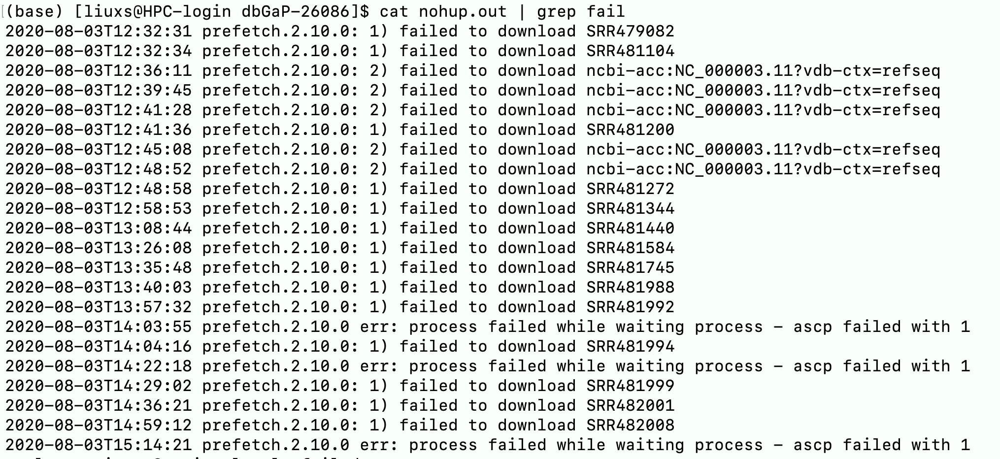

目标任务：

由于下载中断以及部分任务下载失败，现在需要分步骤完成以下目标

- 取得目录下下载成功的文件的前缀，命名为`done.txt`

  ```shell
  $ for i in *.sra;do basename $i .sra;done > done.txt
  ```

- 将`done.txt`文件中和最初用来储存下载文件名的文件进行比对，删除已经完成的任务名，并将最后去除并集的任务内容输出到新文件`redown.txt`中

  ```shell
  $ grep -v -f file1 file2 >redown.txt
  ```

  > -v : 反向匹配，输出没有匹配上的项
  >
  > -f : 从文件中读取匹配模式，file1中匹配模板，反向匹配file2中的内容

- 更改shell脚本内容，针对`redown.txt`的内容进行下载

  ```shell
  $ nohup bash download.sh &
  ```


目标任务：

输出的out文件中提示，部分样本下载失败，我现在需要提取这些失败的提示信息中的SRA id进行重新下载



```shell
$ cat nohup.out | grep fail | awk '{print $7}' | grep SRR > fail.txt
$ less fail.txt
SRR479082
SRR481104
SRR481200
SRR481272
SRR481344
SRR481440
SRR481584
SRR481745
SRR481988
SRR481992
SRR481994
SRR481999
SRR482001
SRR482008
```

> cat : 读取文件
>
> grep : 提取含有fail的一列信息
>
> awk : 打印出第7列的内容
>
> grep SRR : 在第7列的内容中提取含有SRR的一列

这样就提取出了需要下载的id


目标任务：

删除file2中存储在file1中的id号的文件

```shell
$ for i in `cat need_download`;do rm $i*;done
```

