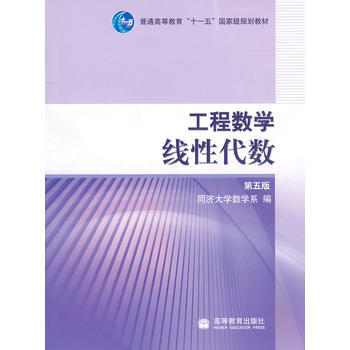

### 参考资料：

------

### 引言

- 为什么要讲线性代数
- 线性代数在生信方面的应用

#### 一、二元线性方程组与二阶行列式

消元法解二元线性方程组，消去未知数 $x_{2}$ 
$$
\begin{Bmatrix}
a_{11}x_{1} + a_{12}x_{2} = b_{1},\\ 
a_{21}x_{1} + a_{22}x_{2} = b_{2}
\end{Bmatrix}
$$
当$a_{11}a_{22}-a_{12}a_{21}\neq 0$时
$$
x_{1} = \frac{b_{1}a_{22}-a_{12}b_{2}}{a_{11}a_{22}-a_{12}a_{21}}, \  
x_{2} = \frac{b_{2}a_{11}-a_{21}b_{1}}{a_{11}a_{22}-a_{12}a_{21}}
$$
二行二列的二阶行列式，记作
$$
\begin{vmatrix}
a_{11} \ \ a_{12}\\ 
a_{21} \ \  a_{22}
\end{vmatrix}
$$

- 行列式的元素或元

$$
a_{ij}(i = 1,2;j = 1,2)
$$

- 对角线法（仅适用于二阶和三阶行列式）

  - 主对角线
  - 副对角线

  二阶行列式是主对角线上的两元素之积减去副对角线上两元素之积所得的差。

  

#### 二、三阶行列式

$$
\begin{vmatrix}
a_{11} \ \ a_{12}\ \ a_{13}\\ 
a_{21} \ \  a_{22}\ \ a_{23}\\
a_{31} \ \  a_{32}\ \ a_{33}
\end{vmatrix} = a_{11}a_{22}a_{33} + a_{12}a_{23}a_{31}+a_{13}a_{21}a_{32} -a_{11}a_{23}a_{32}-a_{12}a_{21}a_{33}-a_{13}a_{22}a_{31}
$$

- 对角线法

  

------

#### 逆序数

规定各元素之间有一个标准次序（比如从小到大为标准次序），在任一个排列中，当两个元素的先后次序与标准次序不同时，就说有1个**逆序**，一个排列中所有逆序的总数叫做	**排列的逆序数**。

- 逆序数为奇数的排列叫做**奇排列**

- 逆序数为偶数的排列叫做**偶排列**

  

全体元素逆序数之和：
$$
t = t_{1} + t_{2} + \cdots + t_{n} = \sum_{t = 1}^{n}t_{i}
$$

举例计算：

求32514的逆序数

------

#### 三、n阶行列式

先来看三阶行列式：
$$
\begin{vmatrix}a_{11} \ \ a_{12}\ \ a_{13}\\ a_{21} \ \  a_{22}\ \ a_{23}\\a_{31} \ \  a_{32}\ \ a_{33}\end{vmatrix} = a_{11}a_{22}a_{33} + a_{12}a_{23}a_{31}+a_{13}a_{21}a_{32} -a_{11}a_{23}a_{32}-a_{12}a_{21}a_{33}-a_{13}a_{22}a_{31}
$$
等号右边不管正负号，可以写成 $a_{1p_{1}}a_{2p_{2}}a_{3p_{3}}$ ，第一个下标（行标）次序为123，第二个下标（列标）次序为 $p_{1}p_{2}p_{3}$

带正号列标排列：123，231，312【都是偶排列】

带符号列标排列：132，213，321【都是奇排列】

经过一番操作，三阶行列式可以写成：
$$
\begin{vmatrix}
a_{11} \ \ a_{12}\ \ a_{13}\\ 
a_{21} \ \  a_{22}\ \ a_{23}\\
a_{31} \ \  a_{32}\ \ a_{33}
\end{vmatrix}=\sum (-1)^{t}a_{1p_{1}}a_{2p_{2}}a_{3p_{3}}
$$

- **定义**  推广到n阶行列式

$$
\sum (-1)^{t}a_{1p_{1}}a_{2p_{2}}\cdots a_{np_{n}}
$$

记作：
$$
D = \begin{vmatrix}
a_{11} &a_{12}  &\cdots   &a_{1n} \\ 
a_{21} &a_{22}  &\cdots   &a_{2n} \\ 
\vdots &\vdots  &   &\vdots \\ 
a_{n1} &a_{n2}  &\cdots   &a_{nn} 
\end{vmatrix}
$$

- 对角行列式

证明n阶行列式
$$
\begin{vmatrix}
\lambda _{1} &  &  &  & \\ 
 &  &\lambda _{2}  & \\ 
 &  &  &\ddots   & \\ 
 &  &  &  &\lambda _{n} 
\end{vmatrix}= \lambda _{1}\lambda _{2}\cdots \lambda _{n}
$$
其中没有写出来的元素都是0，左端称为**对角行列式**

- 上下三角形行列式

  主对角线以下（上）的元素都为0的行列式叫做**上下三角形行列式**，它的值与对角行列式一样

证明以下行列式
$$
D=\begin{vmatrix}
 a_{11}&  &  &  0& \\ 
 a_{21}&a_{22}&  &  & \\ 
 \vdots &  \vdots & \ddots  &  & \\  
 a_{n1}&  a_{n2}& \cdots  &a_{nn}  
\end{vmatrix} = a_{11}a_{22}\cdots a_{nn}
$$

------

#### 对换

**定理1**	一个排列中的任意两个元素对换，排列改变奇偶性

**定理2**	n阶行列式也可定义为

其中t为行标排列	$p_{1}p_{2}...p_{n}$	的逆序数

------

#### 四、行列式的性质

- 转置行列式

$$
D^{T}=\begin{vmatrix}
 a_{11}& a_{12}  & \cdots  & a_{1n}  \\ 
 a_{21}& a_{22}& \cdots  & a_{2n}  \\ 
 \vdots &  \vdots &    & \vdots   \\  
 a_{n1}&  a_{n2}& \cdots  & a_{nn}  
\end{vmatrix}
$$

##### 性质1	行列式与它的转置行列式相等

$$
D^{T}=\begin{vmatrix}
 b_{11}& b_{12}  & \cdots  & b_{1n}  \\ 
 b_{21}& b_{22}& \cdots  & b_{2n}  \\ 
 \vdots &  \vdots &    & \vdots   \\  
 b_{n1}&  b_{n2}& \cdots  & b_{nn}  
\end{vmatrix}
$$

##### 性质2	互换行列式的两行（列），行列式变号

##### 推论	如果行列式有两行（列）完全相同，则此行列式等于0

##### 性质3	

##### 性质4	

##### 性质5 	若行列式的某一列（行）的元素都是两数之和，例如第i列的元素都是两数之和：

$$
D = \begin{vmatrix}
a_{11} &a_{12}  &\cdots &(a_{1i}+a{}'_{1i})   &a_{1n} \\ 
a_{21} &a_{22}  &\cdots &(a_{2i}+a{}'_{2i})  &a_{2n} \\ 
\vdots &\vdots  &   &\vdots &\vdots \\ 
a_{n1} &a_{n2}  &\cdots  &(a_{ni}+a{}'_{ni}) &a_{nn} 
\end{vmatrix}
$$

$$
D = \begin{vmatrix}
a_{11} &a_{12}  &\cdots &a_{1i}   &a_{1n} \\ 
a_{21} &a_{22}  &\cdots &a_{2i}  &a_{2n} \\ 
\vdots &\vdots  &   &\vdots &\vdots \\ 
a_{n1} &a_{n2}  &\cdots  &a_{ni} &a_{nn} 
\end{vmatrix}+\begin{vmatrix}
a_{11} &a_{12}  &\cdots &a{}'_{1i}   &a_{1n} \\ 
a_{21} &a_{22}  &\cdots &a{}'_{2i}  &a_{2n} \\ 
\vdots &\vdots  &   &\vdots &\vdots \\ 
a_{n1} &a_{n2}  &\cdots  &a{}'_{ni} &a_{nn} 
\end{vmatrix}
$$

##### 性质6	行列式与它的转置行列式相等

尝试计算一下:
$$
\begin{vmatrix}
3 & 1 & -1 & 2\\ 
-1 &  1&  3& -4\\ 
2 &  0&  1& -1\\ 
1 &  -5&  3& -3
\end{vmatrix}
$$

$$
D=\begin{vmatrix}
a_{11} &\cdots  &a_{1k}     \\ 
\vdots &   &\vdots  & &0\\ 
a_{k1} &\cdots &a_{kk} \\
c_{11} &\cdots   &c_{1k} &b_{11}  &\cdots &b_{nn}\\ 
\vdots &  &\vdots   &\vdots & &\vdots\\ 
c_{n1}  &\cdots &c_{nk} &b_{n1} &\cdots &b_{nn} \\ 
\end{vmatrix}
$$

$$
D_{1}=\begin{vmatrix}
a_{11} &\cdots  &a_{1k}     \\ 
\vdots &   &\vdots  \\ 
a_{k1} &\cdots &a_{kk} \\
\end{vmatrix}
$$

$$
D_{2}=\begin{vmatrix}
b_{11} &\cdots  &b_{1n}     \\ 
\vdots &   &\vdots  \\ 
b_{n1} &\cdots &b_{nn} \\
\end{vmatrix}
$$

